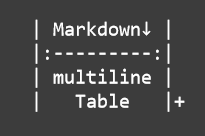

<!--
SPDX-FileCopyrightText: 2025 German Aerospace Center (DLR)
SPDX-License-Identifier: CC-BY-4.0
-->

<!-- markdownlint-disable-next-line MD025 -->
# Multiline Table extension for Python Markdown

This project extends the Python markdown implementation with multiline table support.
It can be easily used with [Python-Markdown](https://python-markdown.github.io) and [MkDocs](https://www.mkdocs.org) as well as [Material for MkDocs](https://squidfunk.github.io/mkdocs-material).



## Install

The main installation is as easy as any other pip package.

//// tab | pip

/// tab | ssh

```bash
pip install -U "git+ssh://git@github.com/DLR-KI/md-multiline-table.git@main"
```

///

/// tab | https

```bash
pip install -U "git+https://github.com/DLR-KI/md-multiline-table.git@main"
```

///

////

//// tab | pyproject.toml

/// tab | ssh

```toml
dependencies = [
  "dlr-logging @ git+ssh://git@github.com/DLR-KI/md-multiline-table.git@main",
]
```

///

/// tab | https

```toml
dependencies = [
  "dlr-logging @ git+https://github.com/DLR-KI/md-multiline-table.git@main",
]
```

///

////

//// tab | setup.py

/// tab | ssh

```python
install_requires = [
    "dlr-logging @ git+ssh://git@github.com/DLR-KI/md-multiline-table.git@main",
]
```

///

/// tab | https

```python
install_requires = [
    "dlr-logging @ git+https://github.com/DLR-KI/md-multiline-table.git@main",
]
```

///

////

//// tab | poetry

/// tab | ssh

```toml
[tool.poetry.dependencies]
dlr-logging = { git = "git+ssh://git@github.com/DLR-KI/md-multiline-table.git", branch = "main" }
```

///

/// tab | https

```toml
[tool.poetry.dependencies]
dlr-logging = { git = "git+https://github.com/DLR-KI/md-multiline-table.git", branch = "main" }
```

///

////

To finally be ready just make sure that your desired target uses the extension.

### markdown package

```python
from markdown import markdown
from md_multiline_table import MultilineTableExtension

html = markdown(text, extensions=[MultilineTableExtension()])
```

### mkdocs

Just add `md-multiline-table` inside the `markdown_extensions` of your `mkdocs.yml` file.

```yaml
markdown_extensions:
  - md-multiline-table
```

## Usage

We all know the issue with tables which include a description or any other free text column.
The result is always the same.
The table will be large and not as pretty and overseeable as small markdown tables.

```markdown
| Module ID | Class | Description                                                        |
|----------:|:-----:|--------------------------------------------------------------------|
|       321 |   1   | Long description text                                              |
|      1234 |   3   | An even longer description text which would be better in two lines |
|        42 |   1   | Short description                                                  |
```

This markdown extension tries to solve this issue with two fairly simple approaches:

- plus sign ending
- colons

### Plus sign ending approach  (`|+`)

Each row which ends with a plus sing `+` will be added to the previous row.
This approach has the big advantage that the table is even displayed as a correct table even if the extension is not used.

### Colon approach (`:`)

Each row which uses colons `:` instead of pipes `|` as table borders will be added to the previous row.
This approach looks nearly identical to normal markdown tables.

## Examples

All of the following examples will generate the same result as the example table above.

/// tab | plus sign `|+`

<h3 id="plus-example-1">Example 1</h3>

Easiest way to use multiline tables.

```markdown
| Module ID | Class | Description                        |
|----------:|:-----:|------------------------------------|
|       321 |   1   | Long description text              |
|      1234 |   3   | An even longer description text    |
|           |       | which would be better in two lines |+
|        42 |   1   | Short description                  |
```

<h3 id="plus-example-2">Example 2</h3>

It is not important where the conext or empty cells are inside a multiline table.

```markdown
| Module |       |                                    |
| ID     | Class | Description                        |+
|-------:|:-----:|------------------------------------|
|    321 |   1   | Long description text              |
|        |   3   | An even longer description text    |
|   1234 |       | which would be better in two lines |+
|     42 |   1   | Short description                  |
```

<h3 id="plus-example-3">Example 3</h3>

My currently preferred method for making each "complete" line easily identifiable is to use blank lines so that the naked eye can immediately tell where a line begins and ends.

```markdown
| Module ID | Class | Description                        |
|----------:|:-----:|------------------------------------|
|       321 |   1   | Long description text              |
|           |       |                                    |+
|      1234 |   3   | An even longer description text    |
|           |       | which would be better in two lines |+
|           |       |                                    |+
|        42 |   1   | Short description                  |
```

///

/// tab | colons `:`

<h3 id="colon-example-1">Example 1</h3>

Easiest way to use multiline tables.

```markdown
| Module ID | Class | Description                        |
|----------:|:-----:|------------------------------------|
|       321 |   1   | Long description text              |
|      1234 |   3   | An even longer description text    |
:           :       : which would be better in two lines :
|        42 |   1   | Short description                  |
```

<h3 id="colon-example-2">Example 2</h3>

It is not important where the conext or empty cells are inside a multiline table.

```markdown
| Module |       |                                    |
: ID     : Class : Description                        :
|-------:|:-----:|------------------------------------|
|    321 |   1   | Long description text              |
|        |   3   | An even longer description text    |
:   1234 :       : which would be better in two lines :
|     42 |   1   | Short description                  |
```

<h3 id="colon-example-3">Example 3</h3>

My current preferred method for making each "complete" line easily identifiable is to use blank lines so that the naked eye can immediately tell where a line begins and ends.

```markdown
| Module ID | Class | Description                        |
|----------:|:-----:|------------------------------------|
|       321 |   1   | Long description text              |
:           :       :                                    :
|      1234 |   3   | An even longer description text    |
:           :       : which would be better in two lines :
:           :       :                                    :
|        42 |   1   | Short description                  |
```

///
